# bevy_openusd

[OpenUSD](https://openusd.org) as a native scene format for [Bevy](https://bevy.org) 0.19.
`usd_bevy` is the library: it loads and composes USD stages, keeps them live, and
writes edits back with undo/redo and save. `usdview` is the editor built on it.

| 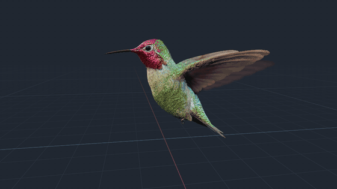 | 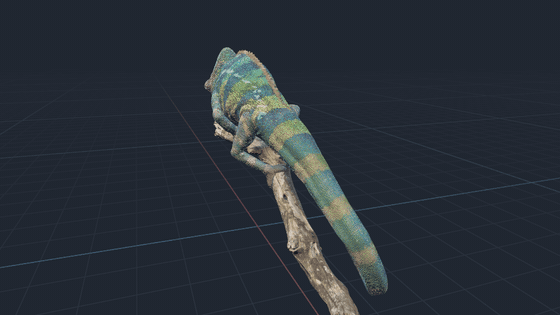 | 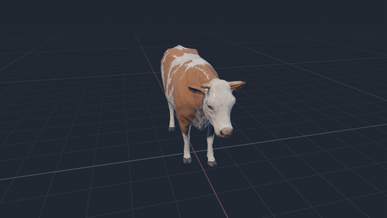 |
| --- | --- | --- |

UsdSkel animation, with the bone overlay from `UsdSkeletonOverlayPlugin`
(`skeleton_overlay` feature) switched on part of the way.

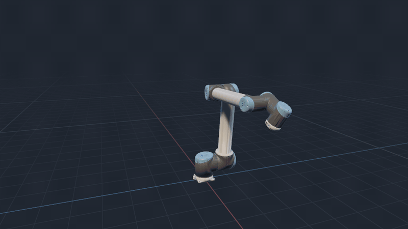

A UR10 moving a box between two pedestals, its joints solved by inverse
kinematics and authored as USD time samples. While it carries, the joint
overlay from `UsdPhysicsOverlayPlugin` (`physics_overlay` feature) shows
joint frames, axes, body links and limits.

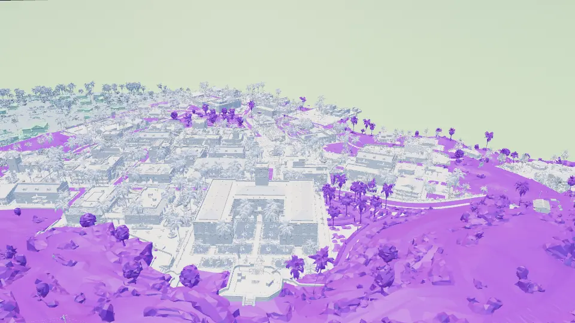

Activision's Caldera with its capital district at full detail: two million
prims and 616k meshes, loaded and projected in about six minutes. The rest of
the island stays at its proxy detail (purple).

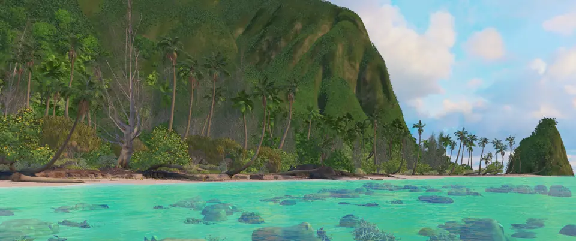

Walt Disney Animation Studios' Moana Island, flying in over the lagoon: 31
million plants and corals drawn by GPU instancing, terrain textured from its
Ptex and displaced, and lit by the island's own sun and sky dome. All six
rendered with `cargo run --example gif_frames`.

## Use it in Bevy

```toml
[dependencies]
bevy = "0.19"
usd_bevy = { git = "https://github.com/openusd-rs/bevy_openusd" }

[patch.crates-io]
bevy_asset = { git = "https://github.com/openusd-rs/bevy_openusd" }
```

```rust
use bevy::prelude::*;
use usd_bevy::{UsdAssetPlugin, UsdPlugin, UsdSceneRoot};

fn main() {
    App::new()
        .add_plugins((DefaultPlugins, UsdPlugin, UsdAssetPlugin))
        .add_systems(Startup, setup)
        .run();
}

fn setup(mut commands: Commands, assets: Res<AssetServer>) {
    commands.spawn(UsdSceneRoot(assets.load("scene.usdz")));
    commands.spawn((Camera3d::default(), Transform::from_xyz(0.0, 3.0, 8.0).looking_at(Vec3::ZERO, Vec3::Y)));
    commands.spawn(DirectionalLight::default());
}
```

The `bevy_asset` patch keeps loads of one source in order, so an older snapshot
never lands after a newer one.

## usdview

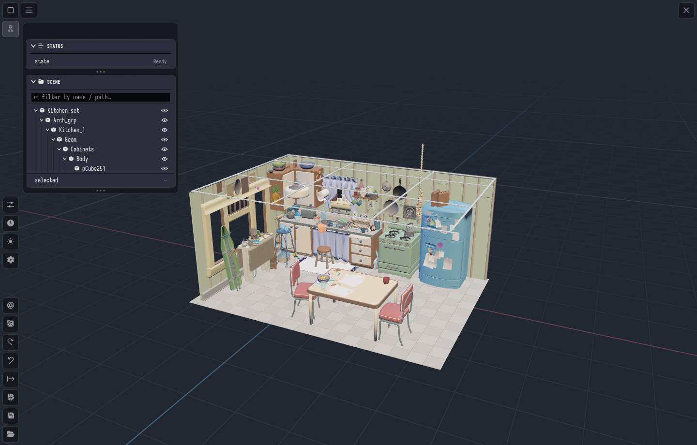

| 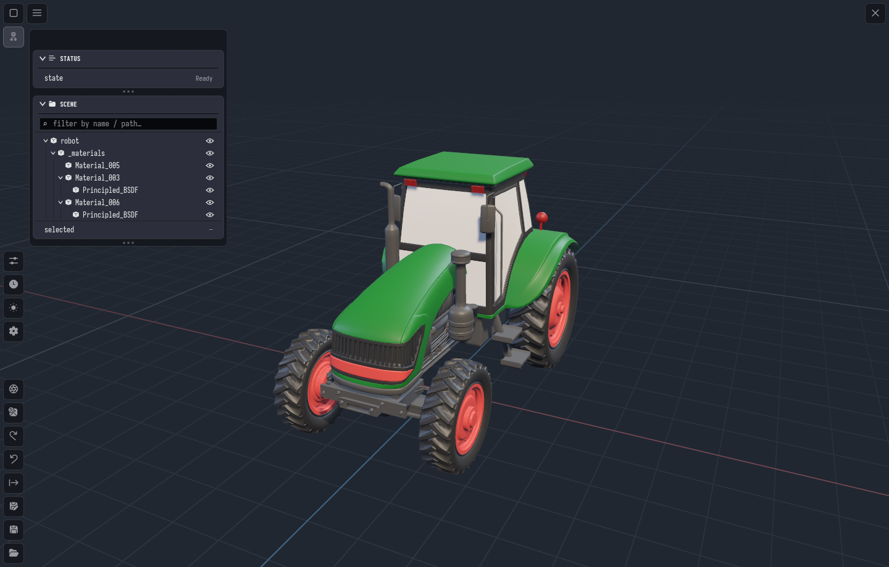 | 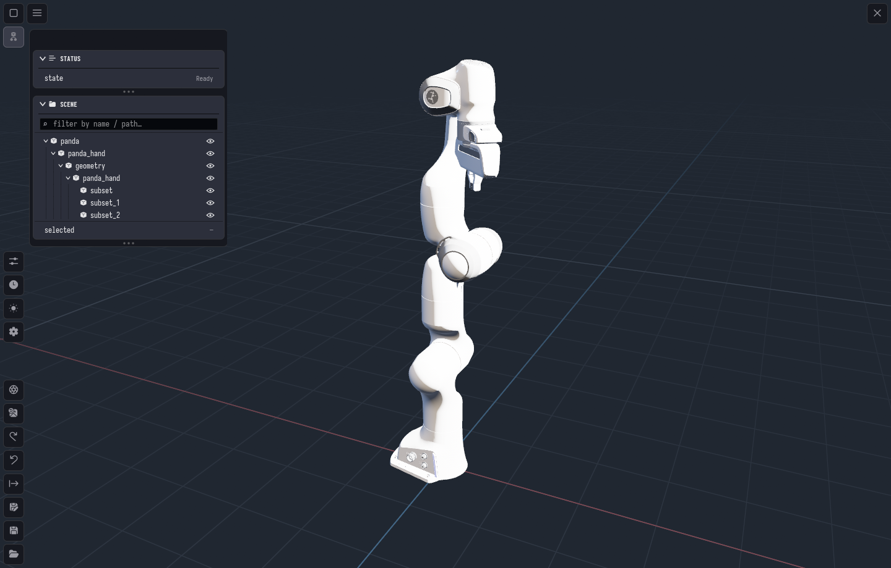 |
| --- | --- |

```sh
direnv allow
make run --args path/to/scene.usd
```

## Web

`usd_bevy` runs on wasm32. `examples/web` loads a `.usdz` through the
AssetServer and a scene from in-memory bytes (`UsdSource::from_memory`):

```sh
make serve-web
```

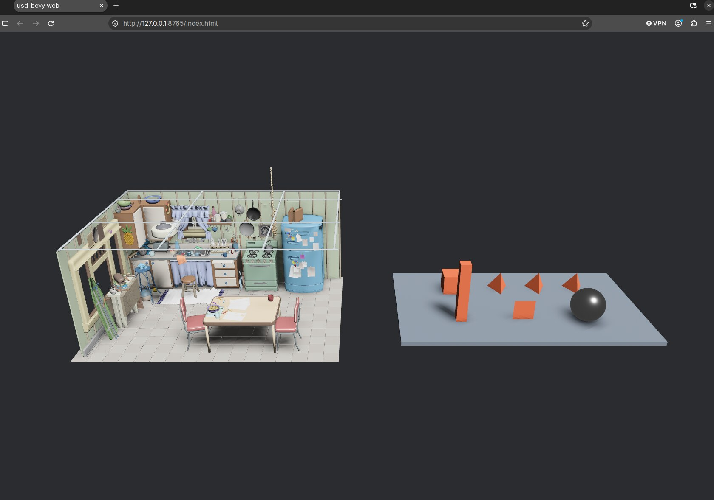

## Used by

[gearbox](https://github.com/robolibs/gearbox), a farm machine and robot simulator
built on `usd_bevy`. Every machine is a USD file.

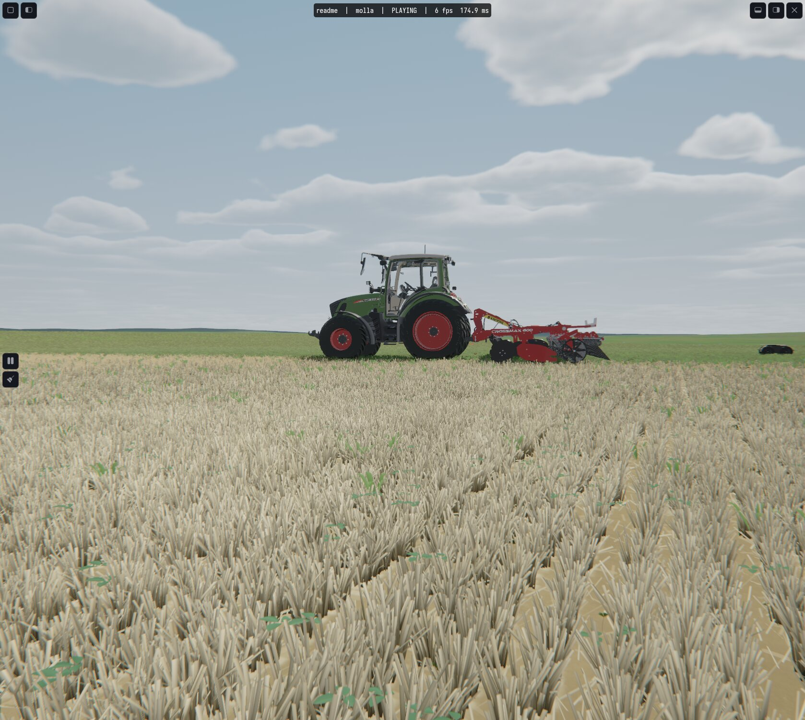

| 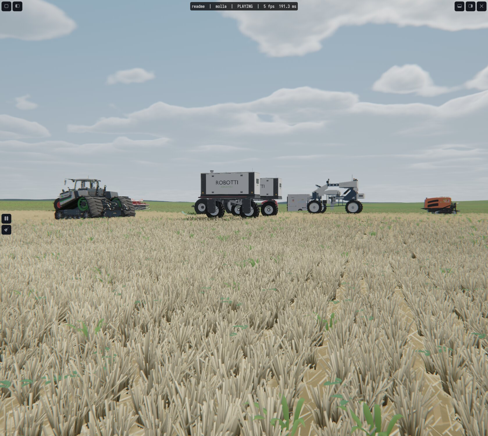 | 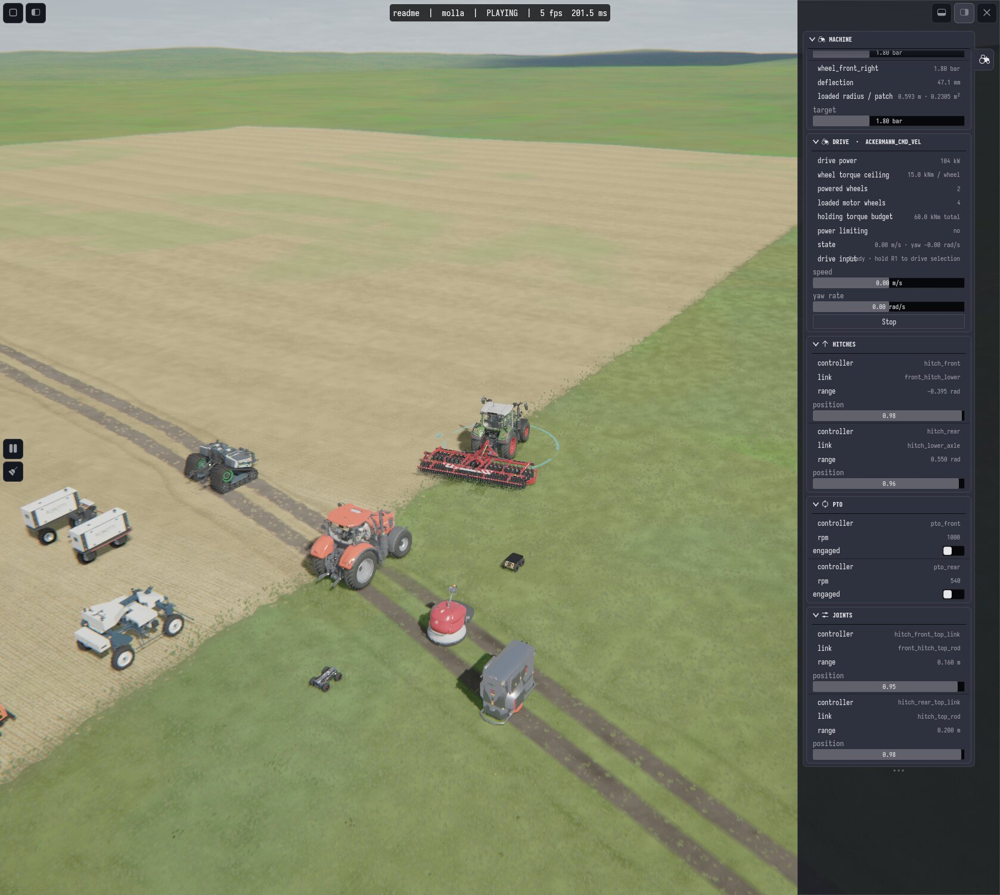 |
| --- | --- |

A Kubota working a stubble field with a Knoche disc harrow, two rows and a
headland turn, in real time. The discs and packer rollers are physics bodies
turned by the soil they cut and ride on, and the worked soil is geometry.
The full video is [on YouTube](https://www.youtube.com/watch?v=6SIxO1Lz-Es).

<a href="https://www.youtube.com/watch?v=6SIxO1Lz-Es">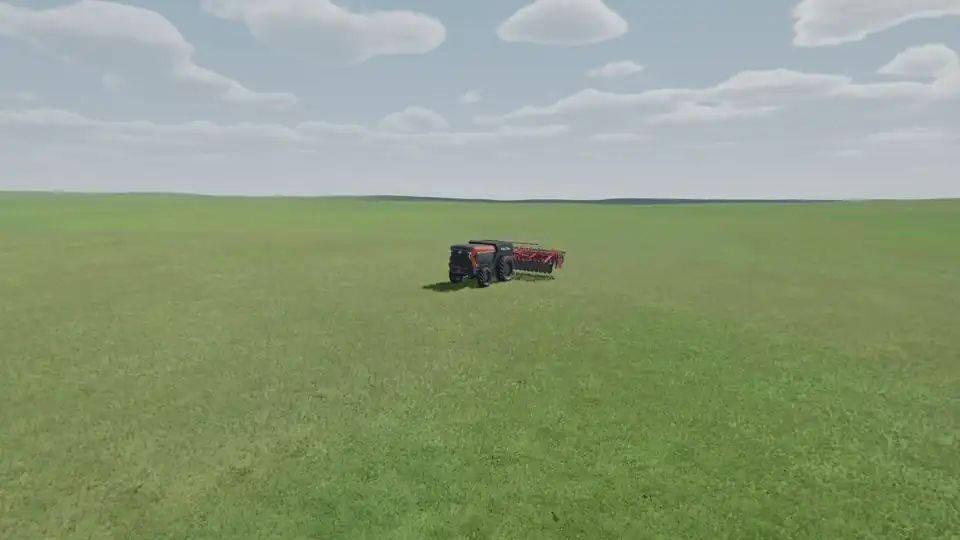</a>

Supported by [Wageningen University & Research](https://www.wur.nl/). MIT licensed.
